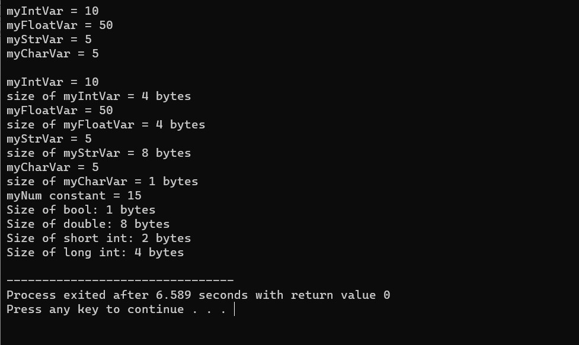

# Datatypes

This C++ program showcases the declaration and usage of various data types, variables, and constants, along with their respective sizes. It covers integer, float, string, char, boolean, and floating-point data types, and it provides information about the sizes of these data types using the sizeof operator. This code serves as a basic example of working with different data types in C++.

  

 
